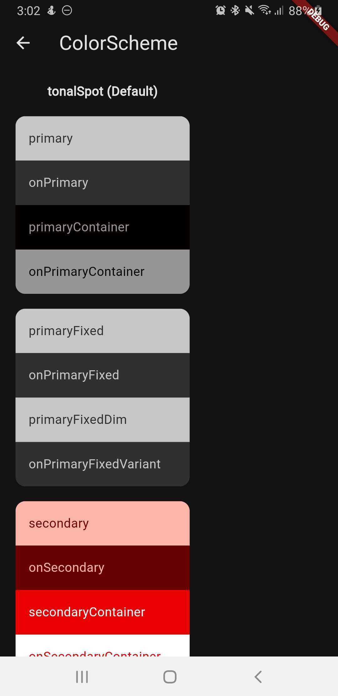
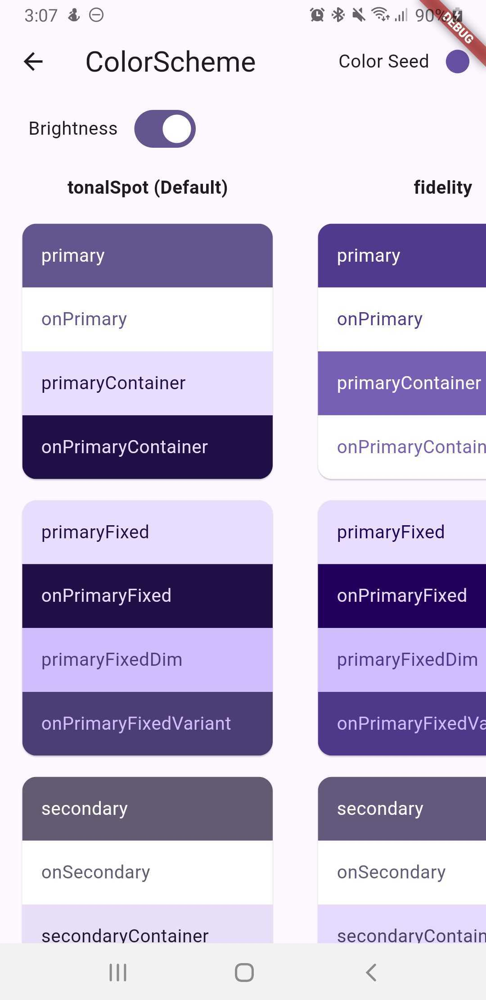
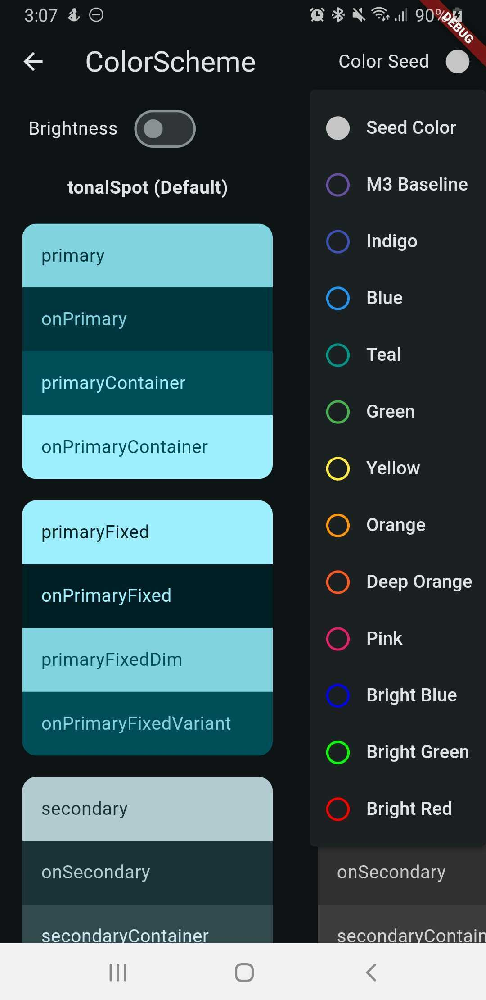

<table>
   <tr>
      <td> </td>
      <td> </td>
      <td> </td>
  </tr>
</table>

# View Color Scheme 👨‍🎨👨‍💻

## Features

The purpose of this package is to visually display the color scheme using `Seeder` or `ThemeData`.

## Installation

Add the package to `pubspec.yaml`

```
    dependencies:
        view_color_scheme: ^0.0.1
```

or

```
    view_color_scheme:
        path: ../../plugins/view_color_scheme
```

or

```
    view_color_scheme:
        git:
            url: https://github.com/jaasaria/flutter.view_color_scheme.git
            ref: main
```

After that import the package.

```
   import 'package:view_color_scheme/view_color_scheme.dart';
```

## Usage

There are two types of implementation: `Seeder` and `ThemeData`. Below is a sample of how to use the class.

1. View the color scheme by `Seeder`

```dart
    VcsOption.setSeedColor(Theme.of(context).colorScheme.primary);
    VcsHelper.navigateToColorSchemeScreen(context);
```

or force; use this when debugging and switching between states

```dart
    VcsOption.setThemeData(null);
    VcsOption.setSeedColor(Theme.of(context).colorScheme.primary);
    VcsHelper.navigateToColorSchemeScreen(context);
```

2. View the color scheme by `ThemeData`

```dart
    VcsOption.setThemeData(Theme.of(context));
    VcsHelper.navigateToColorSchemeScreen(context);
```

## TODO

- [ ] Ability to switch state beetween `Seeder` and `ThemeData` option.

---

Last updated on July 24, 2024
